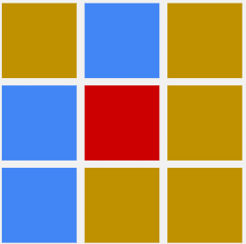
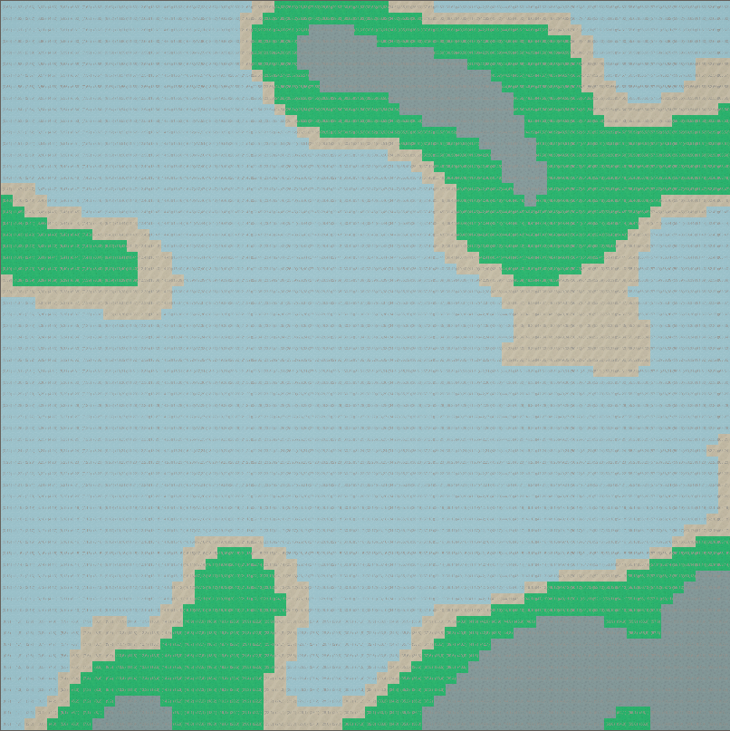
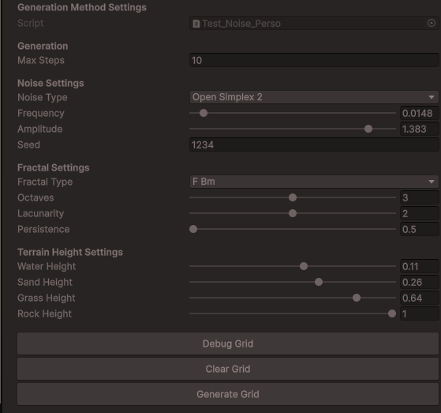

</img>
- - -
**BOURDON Julien**
> Gaming Campus - GTech3  
> Groupe GameBoy - 2025  
> Semaine Théorique sur Unity - `Jeu Procédurale`  
- - -

### Sommaires
 

- [Initialisation](#Initialisation)
- [SimpleRoomPlacement](#SimpleRoomPlacement)
- [BSP](#BSP)
- [CellularAutomata](#CellularAutomata)
- [Noise](#Noise)

- - -
### Initialisation
 

Comment initialiser ce genre de projet ?  
Utilisation de **`UniTask`**:  
--> Guide d'installation ([**Lien UniTask OpenUPM**](https://openupm.com/packages/com.cysharp.unitask/#modal-manualinstallation))  
 
**1ère Etape**  
Sur Unity, dans un projet 3D:  
--> Onglet >Edit  
--> Project Setting  
--> Package Manager  
 
|---- Name  : `package.openupm.com`  
|---- URL   : `https://package/openupm.com`  
|---- Scope : `com.cysharp.unitask`  
 
</img>  
 
 **2ème Etapes**  
 Une fois validé, on peut fermer la fenêtre puis:  
 --> Onglet: Window   
 --> Package Manager  
 --> [+]  
 --> Name: `com.cysharp.unitask` | version: `2.5.10`  
 
 </img>  
</img>  
 
**3ème Etapes:** (Facultatif, seulement si tu souhaite recommencer avec une base basique)  
Une fois UniTask correctement installé, on peut télécharger le package découverte de l'intervenant.    
[**LienDriveCampus**](https://drive.google.com/drive/folders/1QxmWzBSGsTq-miRODwUX_zA8UEcFaUDW)  
Nom du package: `ArchitectureProceduralGeneration.unitypackage`  
Une fois téléchargé, simplement glisser le package dans la Hierarchy Unity, puis import le tout.  
 

- - -

**FIN INITIALISATION**
 
Ici, le projet contient plus d'élément que le simple package de l'étape 3.  
On retrouve les exemples de:  
- SimpleRoomPlacement  
- BSP  
- Cellular Automata  
- Noise  

 

- - -

**Informations Utiles**
 

--> SEED:  
- Ici, on utilise RandomService() avec la Seed pour gérer l'aléatoire.  
- En programmation, l'utilisation d'une Seed permet d'avoir du Pseudo-Aléatoire.  
- En changeant la Seed, on change le résultat, si on réutilise cette même Seed, on retrouvera le même résultat.  
- Utiliser la même façon de gérer l'aléatoire (en utilisant RandomService, permet de retrouver les mêmes décors, mêmes générations en utilisant la même Seed.  

--> Configuration:  
A l'ouverture du projet Unity, utiliser la scène `GridGenerator`.
Sur le GameObject `ProceduralGridGenerator`, vérifier que la variable GenerationMethod utilise le scriptableObject concerné.

</img>  

Si ce n'est pas le bon scriptableObject, pas de panique, pour le trouver:  
Assets > Components > ProceduralGeneration --> Dossier de la partie concerné.  
Simple glisser/déposer du ScriptableObejct dans l'inspector de ProceduralGridGenerator > GenerationMethod.  

- - -
## SimpleRoomPlacement
 

On utilise `ProceduralGridGenerator`, et on utilise le scriptableObject `SimpleRoomPlacement`.  

Voici les étapes du ScriptableObject `Simple Room Placement.cs`  
1. Créer une `Room` de taille aléatoire compris entre `minSizeX / minSizeY` et `maxSizeX / maxSizeY` indiqué dans l'inspetor.
2. Positionne la `Room` aléatoirement dans la grille.
3. Vérifie si la nouvelle `Room` ne chevauche pas une room déjà en place.
4. Réitère l'étape 1 à 3 jusqu'à atteindre `MaxRooms` ou `MaxSteps` inscrit dans l'inspector.

5. Une fois l'étape 4 finis, on relie ensuite les rooms entres-elles.  
En passant par le centre des rooms, on créé des couloirs en forme de "L" en suivant l'ordre d'instanciation:  
Room1 --> Room2 --> Room3 --> etc.  
 

- - -
## BSP
 

On utilise toujours `ProceduralGridGenerator`, mais cette fois on utilise le scriptableObject `New BSP_Correction`.  
Libre à vous d'utiliser et de voir le rendu des autres BSP présents dans le dossier BSP.  
Rappel sur `Binary Tree`:  
</img>  
 
Voici les différentes étapes du BSP imagé par un exemple possible:  

1.   </img>  
Création de la grille mère appelée `Root`.  
2.   </img>  
Création des `Sisters`.  
Avec une coupe aléatoire entre coupe verticale ou horizontale.
3.   </img>  
Continue la création d'autres Sisters dans les Sisters.  
4.   </img>  
Arrête la découpe s'il est impossible de créer d'autreq Sisters tout en respectant les paramètres de tailles minim les.  
S'arrête également si on a atteints les steps maximum possible.  
--> Résultat: Atteinte des Leafs utilisables.  
5.   </img>  
Création des Rooms dans chacune des Leafs, respectant les paramètres inspector (taille et offSet entre le leaf).
6.   </img>  
Création des Corridors, reliant chaque Sisters entre elles (on remonte le BinaryTree).  
Couloir en forme de "L", passant par le centre des Rooms (pas des Leafs).  
Couloir "L" alterne entre vertical ou horizontal également.
7.   </img>  
Résultat final, layer Room > Corridor pour le rendu final.  

 

- - -
## CellularAutomata
 

On utilise toujours `ProceduralGridGenerator`, mais cette fois on utilise le scriptableObject `New CellularAutomata_Correction`.  
Libre à vous d'utiliser et de voir le rendu des autres CellularAutomata présents dans le dossier concerné.  
On retrouve peu de paramètre pour cette partie:
- `MaxSteps`: toujours le nombre de répétition à faire.
- `GroundDesnity`: Pourcentage de "Sol" que de "Eau" (Grass / Water)
- `minGroundNeighbourCount`: Condition pour transformer une case en sol. Ex: minGroundCount = 5, au moins 5 cases doit être "Grass" pour devenir a son tour Grass.
  </img>  
Ici, la case rouge deviendra "Grass" car on retrouve bien minimum 5cases adjacents en "Grass".  

 
Les étapes du CellularAutomata:  
1. Remplir une grille aléatoirement de Grass ou de Water, en fonction du paramètre de pourcentage de l'inspector.  
2. Pour chaque nouvelle itération, on créé un nouveau tableau qui représentera la nouvelle grille, qui reflètera les nouveaux "état" de chaque cellule (mise en place de la condition `minGroundNeighbourCount`).  
3. Analyse la grille de base avec la nouvelle, si une cellule à eut un changement, on change l'état de la cellule concerné (on obtient ainsi une nouvelle grille proprement).  
4. On réitère l'étape 2 et 4 jusqu'à atteindre le nombre MaxSteps.  

 

- - -
## Noise
 

On utilise toujours `ProceduralGridGenerator`, mais cette fois on utilise le scriptableObject `New Test_Noise_Perso`.  
Libre à vous d'utiliser et de voir le rendu des autres Noises présents dans le dossier concerné.  
En comparaison avec CellularAutomata, ici on est baigné dans les paramètres dans l'inspector.
- `noiseType` : Type de bruit. Change le rendu du terrain.
- `frequency` : Gère la fréquence du bruit, petit -> Grande frome, grand -> plus petite
- `amplitude` : Influence la “hauteur” gloable.
- `fractalType`, `octaves`, `lacunarity`, `persistence` : Paramètres pour faire plusieurs couches et ajouter du détail.
- `HeightMap`:  
On gère la coloration des tuiles en fonction de la hauteur des tuiles.  
On retrouve ici:  
`waterHeight`, `sandHeight`, `grassHeight`, `rockHeight`.  
Dans l'inspector, on peut paramètrer le seuils de hauteur pour décider si une case sera Water, Sand, Grass ou Rock.

Exemple de rendu:  
  </img>  
  </img>  

Les étapes du script:  
1. Avec les paramètres de l'inspector, initialise un bruit dans une grille.  
2. On récupère une cellule de la grille, puis note sa hauteur associée.  
3. On compare la hauteur de la cellule, avec les paramètres Water/Sand/Grass/Rock, pour savoir quel état lui mettre.  
4. On peint la cellule à l'état associés.  
5. On répète le processus 2 à 4 pour chaque cellule de la grille pour avoir un rendu.  
6. Change chaque variable dans l'inspector pour tenter d'avoir un résultat sympa (tips: Frequency, Amplitude et les paramètres de HeightSettings sont primordiaux).  

- - -
- - -

 
Remerciement:  
Merci GamingCampus pour le Cursus GTech.  
Et un GRAND Merci à RUTKOWSKI Yona pour son intervention durant ce projet.  

