</img>
- - -
**BOURDON Julien**
> Gaming Campus - GTech3  
> Groupe GameBoy - 2025  
> Semaine Théorique sur Unity - `Jeu Procédurale`  
- - -

### Sommaires
 

- [Initialisation](#Initialisation)
- [SimpleRoomPlacement](#SimpleRoomPlacement)
- [BSP](#BSP)
- [CellularAutomata](#CellularAutomata)
- [Noise](#Noise)

- - -
### Initialisation
 

Comment initialiser ce genre de projet ?  
Utilisation de **`UniTask`**:  
--> Guide d'installation ([**Lien UniTask OpenUPM**](https://openupm.com/packages/com.cysharp.unitask/#modal-manualinstallation))  
 
**1ère Etape**  
Sur Unity, dans un projet 3D:  
--> Onglet >Edit  
--> Project Setting  
--> Package Manager  
 
|---- Name  : `package.openupm.com`  
|---- URL   : `https://package/openupm.com`  
|---- Scope : `com.cysharp.unitask`  
 
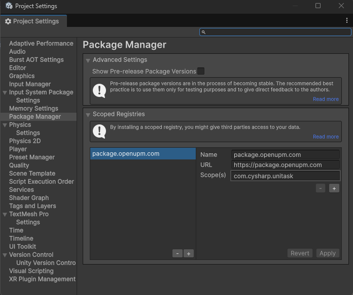</img>  
 
 **2ème Etapes**  
 Une fois validé, on peut fermer la fenêtre puis:  
 --> Onglet: Window   
 --> Package Manager  
 --> [+]  
 --> Name: `com.cysharp.unitask` | version: `2.5.10`  
 
 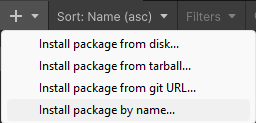</img>  
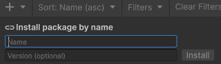</img>  
 
**3ème Etapes:** (Facultatif, seulement si tu souhaite recommencer avec une base basique)  
Une fois UniTask correctement installé, on peut télécharger le package découverte de l'intervenant.    
[**LienDriveCampus**](https://drive.google.com/drive/folders/1QxmWzBSGsTq-miRODwUX_zA8UEcFaUDW)  
Nom du package: `ArchitectureProceduralGeneration.unitypackage`  
Une fois téléchargé, simplement glisser le package dans la Hierarchy Unity, puis import le tout.  
 

- - -

**FIN INITIALISATION**
 
Ici, le projet contient plus d'élément que le simple package de l'étape 3.  
On retrouve les exemples de:  
- SimpleRoomPlacement  
- BSP  
- Cellular Automata  
- Noise  

 

- - -

**Informations Utiles**
 

--> SEED:  
- Ici, on utilise RandomService() avec la Seed pour gérer l'aléatoire.  
- En programmation, l'utilisation d'une Seed permet d'avoir du Pseudo-Aléatoire.  
- En changeant la Seed, on change le résultat, si on réutilise cette même Seed, on retrouvera le même résultat.  
- Utiliser la même façon de gérer l'aléatoire (en utilisant RandomService, permet de retrouver les mêmes décors, mêmes générations en utilisant la même Seed.  

- - -
## SimpleRoomPlacement
 

A l'ouverture du projet Unity, utiliser la scène `GridGenerator`.
Sur le GameObject `ProceduralGridGenerator`, vérifier que la variable GenerationMethod utilise le scriptableObject `Simple Room Placement`.

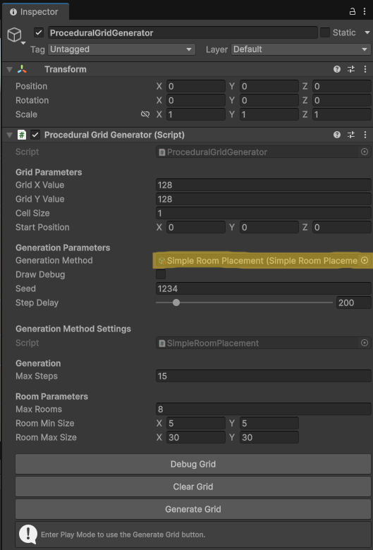</img>  

Si ce n'est pas le bon scriptableObject, pas de panique, pour le trouver:  
Assets > Components > ProceduralGeneration > 0_SimpleRoomPlacement > `SimpleRoomPlacement`  
Simple glisser/déposer dans l'inspector de ProceduralGridGenerator > GenerationMethod.  

Voici les étapes du ScriptableObject `Simple Room Placement.cs`  
1. Créer une `Room` de taille aléatoire compris entre `minSizeX / minSizeY` et `maxSizeX / maxSizeY` indiqué dans l'inspetor.
2. Positionne la `Room` aléatoirement dans la grille.
3. Vérifie si la nouvelle `Room` ne chevauche pas une room déjà en place.
4. Réitère l'étape 1 à 3 jusqu'à atteindre `MaxRooms` ou `MaxSteps` inscrit dans l'inspector.

5. Une fois l'étape 4 finis, on relie ensuite les rooms entres-elles.  
En passant par le centre des rooms, on créé des couloirs en forme de "L" en suivant l'ordre d'instanciation:  
Room1 --> Room2 --> Room3 --> etc.  
 

- - -
## BSP
 

On utilise toujours `ProceduralGridGenerator`, mais cette fois on utilise le scriptableObject `New BSP_Correction`.  
Libre à vous d'utiliser et de voir le rendu des autres BSP présents dans le dossier BSP.  
Rappel sur `Binary Tree`:  
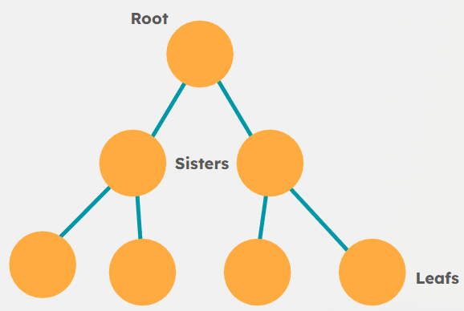</img>  
 
Voici les différentes étapes du BSP imagé par un exemple possible:  

1.   </img>  
Création de la grille mère appelée `Root`.  
2.   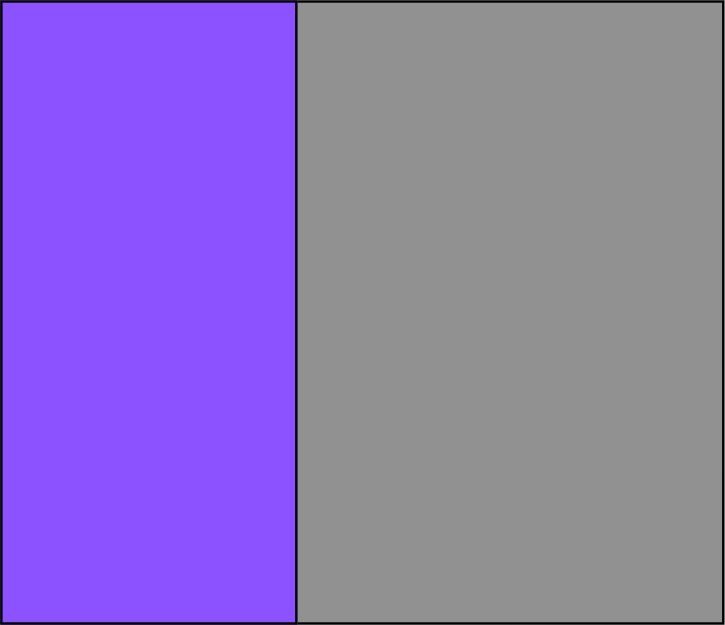</img>  
Création des `Sisters`.  
Avec une coupe aléatoire entre coupe verticale ou horizontale.
3.   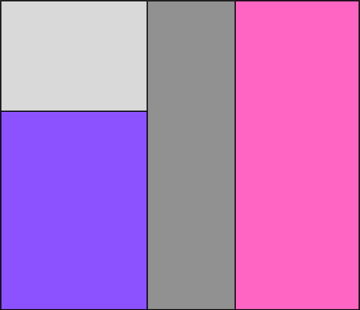</img>  
Continue la création d'autres Sisters dans les Sisters.  
4.   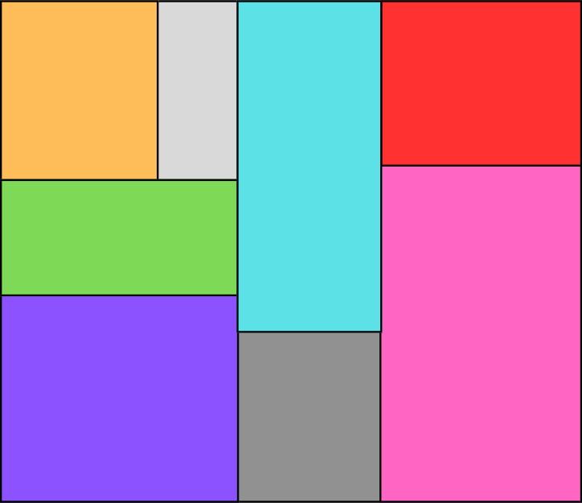</img>  
Arrête la découpe s'il est impossible de créer d'autreq Sisters tout en respectant les paramètres de tailles minim les.  
S'arrête également si on a atteints les steps maximum possible.  
--> Résultat: Atteinte des Leafs utilisables.  
5.   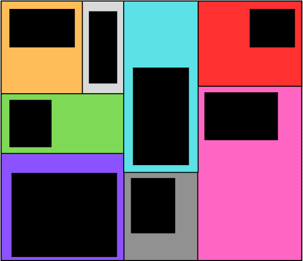</img>  
Création des Rooms dans chacune des Leafs, respectant les paramètres inspector (taille et offSet entre le leaf).
6.   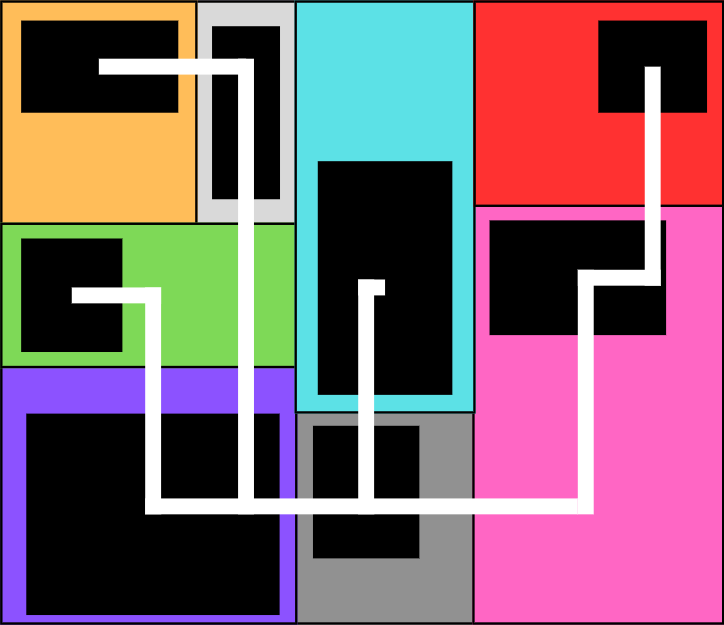</img>  
Création des Corridors, reliant chaque Sisters entre elles (on remonte le BinaryTree).  
Couloir en forme de "L", passant par le centre des Rooms (pas des Leafs).  
Couloir "L" alterne entre vertical ou horizontal également.
7.   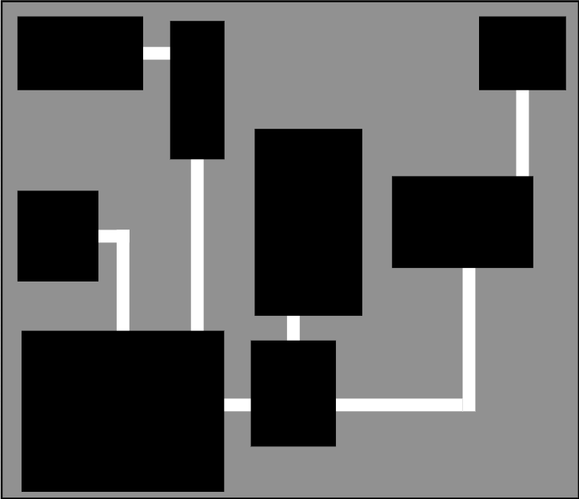</img>  
Résultat final, layer Room > Corridor pour le rendu final.

- - -
## CellularAutomata
 

Partie explication Cellular Automata

1.
1.
1.
1.
1.
1.
1.
1.
1.
1.
1.
1.
1.
1.
1.
1.

- - -
## Noise
 

Partie explication Noise

1.
1.
1.
1.
1.
1.
1.
1.
1.
1.
1.
1.
1.
1.
1.
1.
1.
