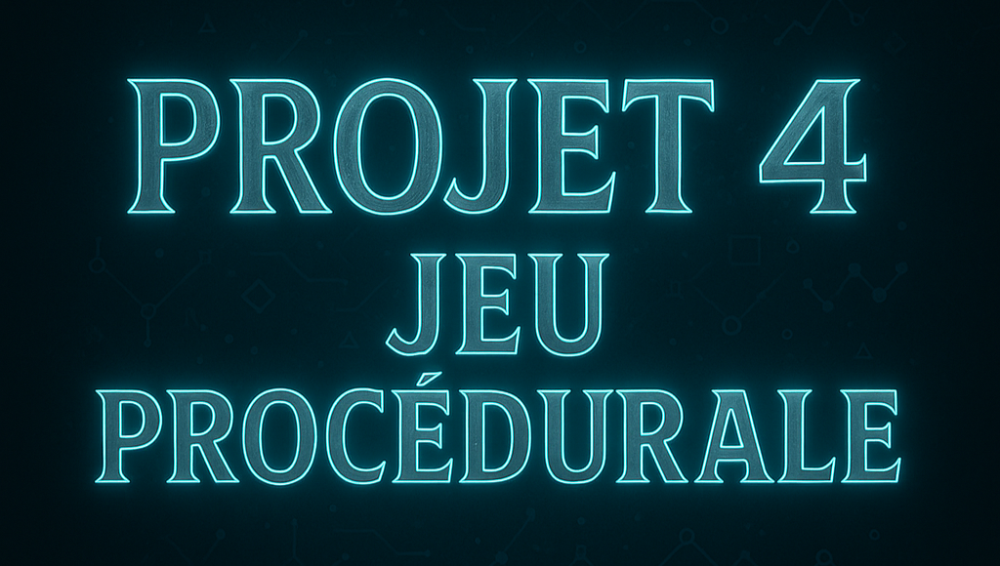

- - -
**BOURDON Julien**
> Gaming Campus - GTech3  
> Group GameBoy - 2025  
> Semaine Théorique sur Unity - `Jeu Procédurale`  
- - -

## Table of Contents
- - -

Details

- [SimpleRoomPlacement](#SimpleRoomPlacement)
- [BSP](#BSP)
- [CellularAutomata](#CellularAutomata)
 

- - -

### SimpleRoomPlacement
- - -

### SimpleRoomPlacement
- - -
Partie explication SimpleRoomPlacement

5.
5.
5.
5.
5.
5.
5.
5.
5.
5.
5.
5.
5.
5.
5.
5.
5.
5.

### BSP
- - -
Partie explication BSP

5.
5.
5.
5.
5.
5.
5.
5.
5.
5.
5.
5.
5.
5.
5.
5.
5.
5.
5.
5
5

 ### CellularAutomata
 - - -
 Partie explication Cellular Automata

5
5
5
5
5
5
5
5
5
5
5
5
5
5
5
5
5
5
5
